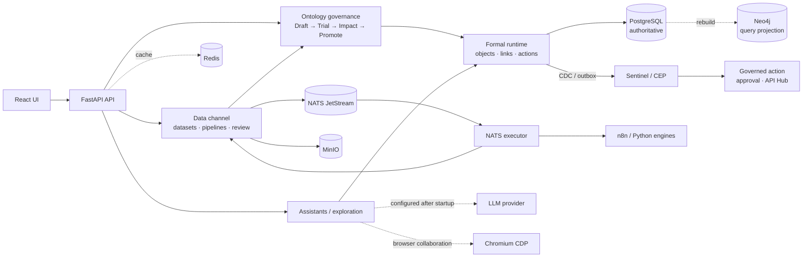

# OpenOntology

> **把多源数据组织成可理解、可治理、可行动的共享本体。**
>
> **A general-purpose ontology platform for governed, explainable action.**

OpenOntology turns heterogeneous data into a shared, versioned semantic model. It is a
general-purpose platform: the same objects, relationships, events, rules, versions and
actions can describe orders, assets, services, policies, controls, or other domains.


## Architecture

The platform separates the semantic model from source systems and delivery channels:



The normal semantic path is:

```text
versioned data → ontology mapping → Draft → Trial → Impact → Promote
→ Formal/query projection → Sentinel → reviewable action
```

This diagram describes repository boundaries, not a promise that every external system is
pre-integrated. In particular, event registration is currently an independent capability;
the platform does not advertise an automatic `RegisteredEvent → Formal/Sentinel` chain.

## Core capabilities

- **Model and govern** — define objects, relationships, rules and actions, then release
  immutable ontology versions through explicit gates.
- **Connect and steward data** — version datasets, run pipelines, map records and review
  curated outputs.
- **Explore and assist** — bind semantic exploration and assistant sessions to an ontology
  boundary, with approvals, artifacts and call history.
- **Observe and act** — evaluate state changes and CEP patterns with Sentinel, then route
  reviewable actions through configured permissions.
- **Integrate** — expose controlled API Hub interfaces and selected Plugin/MCP tools.

See the [capability matrix](./docs/product/capability-matrix.md) for status, evidence and
release limits. Semantic search is not advertised: the current implementation returns
`501 semantic_search_unsupported` for semantic mode; keyword search uses PostgreSQL.

## Quick start

From the cloned repository root, configure and start the local stack:

```bash
cp .env.example .env
# Set N8N_API_URL and N8N_API_KEY in .env for a reachable external n8n instance.
docker compose -f docker-compose.local.yml up --build
```

Open the frontend at `http://localhost:5173`. The complete stack requires PostgreSQL,
Redis, NATS, the pipeline executor, Neo4j, MinIO, n8n and Chromium CDP. Configure a model
provider after startup if assistant or exploration features are needed.

Check `http://localhost:8000/health/ready` to verify the complete runtime dependencies.

For source development, follow [development setup](./docs/development/setup.md). For
deployment, rollback and backups, start with the [operations guide](./docs/operations/README.md).

## Documentation

| Need | Entry point |
|---|---|
| Product story and capability status | [Product documentation](./docs/product/README.md) |
| Architecture diagram and boundaries | [Product architecture](./docs/product/architecture.md) |
| Synthetic cross-domain examples | [Synthetic cases](./docs/product/synthetic-cases.md) |
| Local setup and test gates | [Development documentation](./docs/development/README.md) |
| Deploy, release and rollback | [Operations documentation](./docs/operations/README.md) |
| Agent and repository constraints | [AGENTS.md](./AGENTS.md) |

All examples and metrics used for promotion are synthetic unless a source and approval are
explicitly recorded. Pricing, licensing, SLA, compliance and customer claims require
commercial approval before publication.
