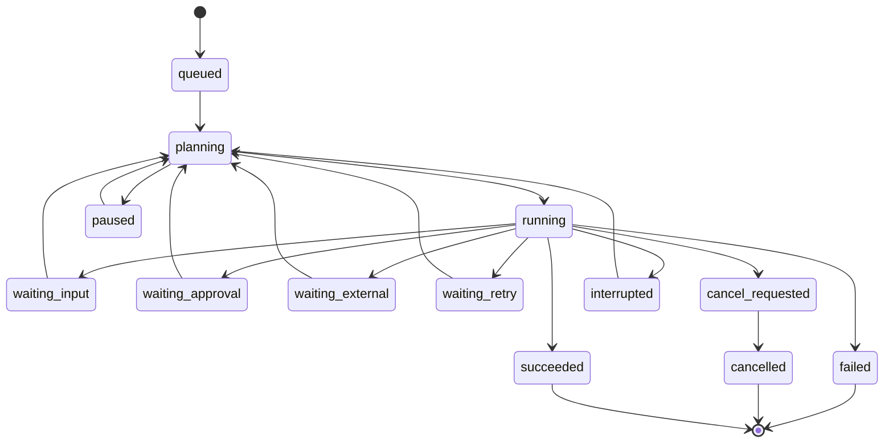

# 超级助手执行模型（提案）

状态：讨论稿

本文细化 [超级助手顶层架构设计](./super-assistant-top-level.md) 中的执行内核，只定义 Run、Turn、Step、Event、Inbox、恢复和取消语义。具体数据库字段、API 路径和 Worker 实现留到后续设计。

## 1. 执行内核的职责

执行内核是一个可恢复的状态机，不负责理解具体业务领域。它只处理：

- 创建和推进 Run、Turn、Step；
- 从 Capability Registry 获取能力；
- 调用 Context Planner 生成请求上下文；
- 持久化模型请求、工具调用、Agent 调用和结果；
- 接收用户输入、审批、外部回调和取消信号；
- 在异常、断连和进程重启后恢复；
- 将事件投影为现有会话和工具查询结果。

业务工具、Memory、Knowledge Graph、MCP、内部助手和外部 Agent 都只能通过能力接口进入内核。

## 2. Run 生命周期



状态含义：

- `queued`：已经创建，等待执行资源；
- `planning`：正在确定下一步任务和上下文；
- `running`：当前有活动 Turn 或 Step；
- `waiting_input`：缺少用户信息，等待 Inbox 输入；
- `waiting_approval`：等待用户审批；
- `waiting_external`：等待外部 Agent 或异步能力回调；
- `waiting_retry`：等待可重试错误的下一次执行；
- `cancel_requested`：已经收到取消，但仍在等待执行单元收尾；
- `interrupted`：进程或 Worker 异常终止，可以恢复；
- `paused`：用户或系统主动暂停；
- `succeeded`、`failed`、`cancelled`：终态。

`waiting_*` 不是错误状态。它们必须携带用户可理解的原因和恢复入口。

终态不可逆。任何重复回调、迟到结果或旧 Worker 更新都不能将终态重新改为运行态。

## 3. Turn 和 Step

一个 Run 可以包含多个 Turn，一个 Turn 可以包含多个 Step：

```text
Run
 ├── Turn 1
 │    ├── Step 1: 生成请求
 │    ├── Step 2: 并行读取资料
 │    └── Step 3: 生成中间判断
 └── Turn 2
      ├── Step 1: 调用外部 Agent
      ├── Step 2: 等待审批
      └── Step 3: 汇总 Artifact
```

### Turn

Turn 是一次模型决策边界。Turn 开始前，内核必须确定：

- 当前 Run 状态；
- 本次用户输入或 Inbox 输入；
- Context Pack；
- system prompt；
- 可见 Capability schema；
- 模型配置和预算。

Turn 结束时必须有明确原因：完成、继续执行、等待输入、等待外部事件、取消或失败。

### Step

Step 是最小可重试单元。建议的 Step 类型包括：

```text
model_request
capability_call
agent_call
approval
context_update
artifact_finalize
```

一个 Step 只能有一个最终结果。重试必须创建新的 attempt 记录或新的 Step 事件，不能覆盖原始失败记录。

## 4. 事件顺序

同一个 Run 内的事件必须拥有单调递增序号。事件写入顺序是模型可见顺序和恢复顺序的基础。

一个典型的模型 Step 顺序如下：

```text
turn.started
step.started
context.snapshot
request.header
assistant.delta*
assistant.message
capability.called*
capability.progress*
capability.result*
step.completed
turn.completed
```

如果模型在响应中产生多个工具调用，工具可以并行执行，但结果必须按照模型声明的调用顺序提交给下一次模型请求。

事件必须遵循：

1. 事件写入成功后才允许广播；
2. 广播失败不能回滚事件；
3. 事件处理器不得直接修改事件历史；
4. 重复事件通过幂等键返回既有结果；
5. 未知事件版本必须拒绝加载或进入兼容处理，不得猜测字段含义。

## 5. 请求重建不变量

发送给模型的请求由以下内容组成：

```text
model configuration
system prompt
Context Pack
visible capability schemas
projected conversation messages
```

请求发送前，内核执行重建校验：

```text
events → conversation projection
events → context snapshot
events → request header
                         ↓
                 actual model request
```

以下任一项不一致，都必须阻止请求并记录错误：

- 消息序列与事件投影不一致；
- system prompt 与快照不一致；
- Capability schema 与请求头不一致；
- Context Pack 的来源、权限或版本不一致；
- 模型配置与本次请求不一致。

敏感凭据不能进入模型请求快照。需要审计时保存加密引用、脱敏摘要和校验哈希，而不是原始凭据。

## 6. Inbox 语义

Inbox 是 Run 的持久化输入通道，至少区分两种目标：

```text
next_turn
next_step
```

### next_turn

用于下一次完整模型决策，例如：

- 用户的新消息；
- 用户对澄清问题的回答；
- 用户对任务的追加要求；
- 用户要求重新规划。

### next_step

用于当前 Run 内的控制和上下文变化，例如：

- 外部 Agent 的进度或最终结果；
- 审批决定；
- 新 Artifact 可用；
- 系统注入的恢复提示；
- 取消或暂停信号。

Inbox 的追加、领取和消费都必须写事件。Worker 重启后，根据事件重建未消费的 Inbox 项。

## 7. 取消语义

取消分为三个层次：

1. **请求取消**：用户或父 Run 写入 `cancel_requested`；
2. **协作取消**：向当前模型、工具和外部 Agent 传播取消令牌；
3. **强制收尾**：超过取消宽限期后，内核结束本地等待并将未完成调用标记为 cancelled 或 interrupted。

不能协作取消的外部系统不能被伪装成已取消。内核必须显示其真实状态，并防止迟到结果重新推进已经取消的 Run。

取消和完成同时到达时，使用条件更新决定唯一终态，并记录竞争事件，便于诊断。

## 8. Worker 与租约

即使当前只服务一个用户，多个会话也可能同时执行。每个活动 Run 由一个 Worker 租约负责：

```text
claim lease
→ heartbeat
→ append event
→ execute step
→ renew or release lease
```

租约必须包含：

- Worker 标识；
- 租约过期时间；
- 当前 Step；
- 最近心跳；
- 取消版本；
- Run 版本。

Worker 失联后，只有租约过期且 Run 仍未进入终态时，其他 Worker 才能接管。旧 Worker 的迟到更新必须因版本不匹配而失败。

## 9. 崩溃恢复

恢复分为三种情况：

### 9.1 Step 已完成

从下一个未完成 Step 继续，不重复执行已完成能力。

### 9.2 Step 已开始但没有结果

根据能力的幂等策略决定：

- 重新执行；
- 查询外部状态；
- 标记为 interrupted 并请求用户确认；
- 进入 waiting_external。

### 9.3 模型请求中断

保留已经记录的 assistant delta 和 request header。恢复时不能把残缺的 delta 当成完整 assistant message，必须生成 interrupted 结果或重新发起新的 Step。

恢复逻辑不得通过猜测修复损坏事件。无法验证顺序、版本或括号闭合时，应拒绝恢复并给出明确诊断。

## 10. 兼容投影

第一阶段同时保留新事件和旧模型：

```text
Event Store
   ├── Conversation / Message projection
   ├── ToolRun projection
   ├── Delegation projection
   └── RemoteTask projection
```

兼容投影只负责查询和旧接口响应，不能反向修改执行事实。旧接口产生的新操作必须先转换成 Kernel command，再由 Kernel 追加事件。

当事件投影和旧表不一致时，优先保留事件并产生告警，不静默覆盖事件。

## 11. 本层验收标准

执行模型进入实现前，至少要有以下纯逻辑测试：

- 所有合法 Run 状态转换；
- 非法状态转换被拒绝；
- 终态不可逆；
- 重复回调幂等；
- 取消与完成竞争只有一个终态；
- 多个并行工具按模型顺序提交；
- Inbox 重启后可重建；
- Worker 租约过期后可接管；
- 迟到 Worker 更新被拒绝；
- 未闭合 Turn/Step 能进入 interrupted；
- 请求与事件快照不一致时阻止模型调用；
- 旧 Conversation、Message、ToolRun 投影与事件结果一致。

具体字段和实现方式必须在这些语义测试确定后再设计。
