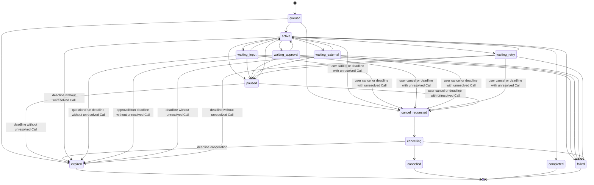

# 超级助手执行模型（提案）

状态：讨论稿

本文细化[顶层架构](./super-assistant-top-level.md)中的执行内核，定义 Run、Turn、Step、Call、Attempt、Event、Inbox、租约和恢复语义。具体数据库字段、HTTP 路径和 Worker 实现另行设计。

## 1. 核心对象

| 对象 | 语义 | 是否可以跨请求存活 |
|---|---|---|
| Conversation | 用户持续交流的容器，可以拥有多个任务 | 是 |
| Run | 一个有目标、输入、约束和验收依据的任务 | 是 |
| Turn | Run 被一次输入或事件唤醒后的执行区间，主动让出执行权时结束 | 通常不跨等待 |
| Step | 一次模型决策及其产生的 Call 登记、等待和归并边界 | 可以因等待而闭合并续行 |
| Call | 一次逻辑能力调用，具有稳定身份、参数快照和副作用语义 | 是 |
| Attempt | 一次实际模型请求或能力发送尝试 | 否 |
| Inbox item | 关联到具体 Run 的用户输入、外部结果、审批或控制命令 | 是 |

`Call` 与 `Attempt` 必须分开。网络超时后，不能因为一次 Attempt 没有回包就创建新的逻辑 Call；是否允许新的 Attempt，要由该能力的副作用分类和状态查询决定。

一个 Conversation 可以包含多个 Run。某个 Run 等待用户输入时，用户可以创建或继续另一个 Run；普通消息不能凭“最近任务”规则自动消费等待项。

## 2. Run 状态



状态含义：

- `queued`：已创建，等待执行资源；
- `active`：有可推进的 Turn 或局部 Call；
- `waiting_input`：某个明确问题等待用户回答；
- `waiting_approval`：某个明确动作等待审批；
- `waiting_external`：等待外部 Agent、MCP Task 或异步系统结果；
- `waiting_retry`：等待下一次可重试 Attempt；
- `paused`：用户或策略主动暂停；
- `cancel_requested`：收到取消请求，仍在收集局部执行状态；
- `cancelling`：本地编排正在收尾；
- `completed`、`failed`、`cancelled`、`expired`：不可逆终态。

等待状态不会锁住 Conversation。所有非终态都可以被取消或因明确截止时间进入 `expired`；等待中的 Run 也可以被显式暂停，暂停后不会消费新的唤醒输入，直到用户恢复。若 Run 中仍有其他独立工作可推进，外部 Call 等待不应把整个 Run 置为等待；只有没有可安全推进的工作时才进入 `waiting_*`。

状态图中的 `active/waiting_*/paused → expired` 是带条件的快捷路径：只有没有未决外部副作用 Call 时才可直接过期；一旦存在未决 Call，必须先经过 `run.expiry_requested → cancel_requested → cancelling`，再按截止时间原因收敛到 `expired`。`cancelling → cancelled` 仅用于用户取消，`cancelling → expired` 仅用于 Run deadline。

以下触发器和边界是状态机的一部分，不能留给 Worker 自行解释：

- `queued` 收到取消或达到 Run 截止时间时，分别进入 `cancel_requested` 或 `expired`；排队中的 Run 也必须可取消。
- `waiting_input` 或 `waiting_approval` 的问题、审批策略、权限或绑定版本失效时，进入 `failed` 或按明确截止时间进入 `expired`，并保留失败原因。
- `cancelling` 必须有 `cancel_deadline`。本地收尾完成后进入 `cancelled`；达到截止时间仍未收到远端确认时，Run 可以进入本地 `cancelled`，但未收敛的 Call 必须保留 `outcome_unknown` 或 `remote_running`，并产生 `run.cancel_timeout` 供对账；本地收尾本身失败时进入 `failed`。
- `paused` 期间到达的普通输入、外部结果和审批决定写入关联 Inbox，但不被消费；取消、过期等控制命令仍走高优先级通道。恢复动作只激活明确的 Run，并按 Inbox 幂等规则消费关联项。
- `active` 必须至少有可消费 Inbox、已领取 Turn、可推进 Call 或计划中的重试之一。否则属于 stuck-run，检测器必须产生诊断事件并进入恢复或人工处理路径，不能保持 `active` 无期限等待。

Run deadline 命中时，如果存在未决外部 Call，不能直接绕过协作取消进入 `expired`：先记录 `run.expiry_requested`，再走 `cancel_requested → cancelling`，取消收敛后按截止时间原因进入 `expired`。没有未决副作用 Call 时才允许直接进入 `expired`。`cancel_requested` 一旦被接受不再转为 `expired`，由第一次成功的终态转换决定取消和截止时间的竞态。

每个 `waiting_input` 问题必须有独立的 `question_expires_at` 和持久化 `expiry_policy`；有效截止时间取 `min(question_expires_at, run.deadline)`。问题 TTL 到期时先关闭该问题并产生 `inbox.expired`，按 `expiry_policy` 选择重新提问、仅失败该分支或终止整个 Run，不能由 Worker 默默二选一。回答是否有效以 `InboxItem.accepted_at` 与 `question_expires_at` 比较，而不是以 Worker 实际处理时间比较；同一 Run 行锁下按事件入库顺序裁决，过期后到达的回答不能复活问题。问题 TTL 不能延长 Run deadline。

Run 进入终态后不能重新打开。若外部迟到结果后来到达，只能作为关联 Call 和 Artifact 的新事实保存，不能恢复已取消的 Run。

等待状态收到事件后的处理不是固定地“恢复运行”：

| 等待原因 | 可恢复事件 | 不可恢复事件 |
|---|---|---|
| `waiting_input` | 关联问题的有效回答 | 问题已过期则 `expired` |
| `waiting_approval` | 关联审批通过或拒绝 | 审批策略失效则 Call 失败并重新规划或终止 |
| `waiting_external` | 远端进度、结果或可查询状态 | 远端确认失败且没有替代路径则 Run 失败 |
| `waiting_retry` | 预算内的新 Attempt | 重试预算耗尽则 Run 失败 |

事件先结束对应 Call 的状态，再决定 Run 是否回到 `active`。不能因为收到一个无关回调就唤醒或改变 Run。

Call 的本地调度状态和外部结果是两条轴，不能合并成第二套状态机：

- `status`：`offered`、`dispatched`、`running`、`waiting_external`、`cancel_requested`、`reconciling`、`closed`；
- `outcome`：`not_sent`、`accepted`、`remote_running`、`completed`、`failed`、`cancelled_confirmed`、`outcome_unknown`。

两轴必须遵守以下不变量：`offered` 只能是 `not_sent`；`dispatched` 可为 `not_sent` 或 `outcome_unknown`；`running`/`waiting_external` 可为 `accepted`、`remote_running` 或 `outcome_unknown`；`cancel_requested`/`reconciling` 可为 `accepted`、`remote_running` 或 `outcome_unknown`；`closed` 只能为 `not_sent`、`completed`、`failed` 或 `cancelled_confirmed`。只有本地能够证明没有发送时，才允许 `status=closed, outcome=not_sent`；网络超时、连接断开或未知回包一律不能猜成 `not_sent`。`accepted` 和 `remote_running` 是外部观测，不代表完成；`remote_running` 不是本地可调度状态。取消请求只写入 `status=cancel_requested` 和取消事件，不写入 `outcome`。

取消后的外部对账使用 `status=reconciling`，确认取消后才进入 `status=closed, outcome=cancelled_confirmed`；Run 已经本地终止时，对账不得重新打开 Run。Call 进入 `outcome_unknown` 后只能由 Kernel recovery/reconciliation service 通过状态查询或人工确认收敛，不能由普通重试覆盖。Connector 只提供远端查询、取消和结果映射，不自行改变 Run 状态。

## 3. Turn、Step、Call、Attempt

```text
Run
 ├── Turn 1
 │    ├── Step 1: 模型决策 + Call 登记
 │    │    ├── Call A / Attempt 1
 │    │    └── Call B / Attempt 1
 │    └── Step 2: 根据结果再次决策
 └── Turn 2: 用户回答澄清问题后继续
```

### Turn

Turn 是一次激活区间，开始时领取 Inbox 输入或继续信号，结束时必须记录关闭原因。Turn 不会在数据库事务中跨越小时级外部等待。

Turn 的状态是 `open | closed`，`turn.closed.reason` 固定为：

```text
waiting_input | waiting_approval | waiting_external | waiting_retry |
paused | completed | cancel_requested | cancelled | expired | failed |
stuck_recovery | interrupted | yielded
```

若模型结果可以立即继续，当前 Step 直接登记下一个 Step；不产生“已关闭但继续”的 Turn。若必须让出调度，使用 `yielded` 作为内部调度原因，并在同一事务登记下一次激活。

### Step

Step 是一次模型决策及其派生 Call 的归并边界。模型请求、可见上下文和能力目录属于 Step 的请求视图。Step 在其 Call 进入 `waiting_external` 前结束并记录等待原因；之后的外部回调通过 Inbox 激活新的 Turn 和新的 Step。Call 与 Run 可以跨请求存活，数据库不保留一个悬挂网络连接。

Step 的状态是 `open | closed`，`step.closed.reason` 固定为：

```text
decision_complete | waiting_input | waiting_approval | waiting_external |
waiting_retry | paused | cancelled | failed | interrupted
```

`decision_complete` 只表示本次模型请求、Call 登记和本地归并已提交，不表示 Run 完成。

### Call

Call 保存目标能力、参数快照、授权快照、稳定幂等键和副作用分类：

```text
read_only
idempotent_write
non_idempotent_write
external_async
```

### Attempt

Attempt 保存一次实际发送、开始、结束、超时、回包或未知结果。重试新增 Attempt，不覆盖原 Attempt。Call 只有在逻辑结果明确时才进入完成或失败；外部写入可能已经发生但回包丢失时进入 `outcome_unknown`，不能自动重发。

## 4. 事件与事务

同一个 Run 内的事件有单调递增序号，但序号是**到达和持久化顺序**，不是模型消息顺序。并行调用可以先持久化 B 的完成，再持久化 A 的完成；下一次模型请求按 `call_index` 和投影规则排列结果。

一次需要改变执行事实的命令必须在同一 PostgreSQL 事务中完成：

```text
command idempotency check
→ lease fencing check
→ state / event append
→ outbox append
→ commit
→ publish / execute delivery
```

NATS 按至少一次投递处理。Outbox 已提交但尚未派发时由发布器补发；消息重复时由执行端用幂等键收敛。租约只能防止旧 Worker 写入新状态，不能撤销已经发送给外部系统的动作。

事件写入后才广播。进度事件可以按时间或大小合并，模型可见内容和最终结果必须单独记录。监听器失败不能回滚事件。

## 5. 请求重建

模型请求视图由以下部分组成：

```text
model configuration
system prompt snapshot
Context Pack snapshot
visible capability schemas
conversation projection
ordered tool / agent results
```

发送前必须验证：

- 消息与事件投影一致；
- system prompt、上下文版本和能力 schema 与快照一致；
- 当前授权仍覆盖所选能力和参数；
- 所有需要进入模型的 Call 结果均有结果事件；
- 结果排序使用 `call_index`，不依赖事件到达顺序。

敏感凭据不进入请求正文快照；审计保存加密引用、脱敏信息和哈希。用户删除正文后，可以保留不含正文的运行元数据，但不能声称仍能完整重建被删除的请求。

## 6. Inbox

Inbox 至少分为：

```text
next_turn  用户消息、澄清回答、追加目标
next_step  进度、审批、Artifact 可用、控制和恢复信号
```

每个 Inbox item 必须带 `run_id`、关联 `call_id` 或 `approval_id`（如果有）、来源和幂等键。用户回答澄清问题时，界面提交原问题的关联 ID；审批不能被另一个 Run 消费。

控制命令具有独立通道和优先级，取消、暂停、过期不应排在阻塞的普通 Step 后等待。领取和消费都写事件，Worker 重启后可以重建未消费项。

## 7. 取消与外部结果

取消分为：

1. `cancel_requested`：记录用户或父 Run 的意图；
2. 协作取消：向模型、工具、MCP Task 或外部 Agent 发送取消请求；
3. 本地收尾：释放租约、停止等待和关闭本地执行；
4. `cancelled`：只有本地 Run 进入终态，不代表每个外部系统都已经停止。

外部协议只提供“取消请求已发送”或“远端确认取消”时，Call 保留真实的远端状态。没有确认时使用 `outcome_unknown` 或 `remote_running`，而不是伪造 `cancelled`。迟到的成功写入必须保留，不能被本地取消覆盖。因用户取消而收敛的 Run 进入本地 `cancelled`，因 Run deadline 而收敛的 Run 进入 `expired`；未决 Call 独立进入 `reconciling`，不得通过改变 Run 终态来掩盖远端状态。

### 7.1 未知结果对账

对账属于 Kernel recovery/reconciliation service，而不是每个 Connector 自己维护的隐式循环。Call 进入 `reconciling` 时保存 `next_reconcile_at`、退避次数、远端状态快照和 `manual_attention` 标记；服务只调用 Connector 的 `query_status`，用 Call 级租约和 fencing 写入结果。初始间隔、退避上限、最大次数和 Run deadline 由部署配置提供（测试可使用 5 秒起步、5 分钟上限的示例值），达到上限或截止时间后进入人工处理，并通过关联 Inbox/通知向用户展示“结果未知”，不得伪造失败或再次发送写操作。

状态查询确认远端仍在执行时记录 `outcome=remote_running`；确认取消时记录 `outcome=cancelled_confirmed`；确认完成或失败时记录相应结果。迟到结果只更新 Call/Artifact 事实，不改变已经终态的 Run。

## 8. 崩溃恢复和幂等

恢复必须根据 Call 的副作用分类：

| 分类 | Worker 失联后的默认动作 |
|---|---|
| `read_only` | 可以重做 Attempt；结果只影响当前 Run |
| `idempotent_write` | 使用同一幂等键查询或重做 |
| `non_idempotent_write` | 先调用状态查询；无法确认则等待用户或外部对账 |
| `external_async` | 使用远端任务 ID 查询；不能凭超时推断失败 |

派发前持久化 Call 意图、目标、参数快照和幂等键。外部系统被接受与外部系统完成是两个事件。

合法事件前缀上的未闭合尾部属于预期崩溃：恢复器可以追加确定性的 `interrupted`、`outcome_unknown` 或 `step.closed` 事件。序号断裂、非法引用、矛盾终态和无法验证的事件 payload 属于损坏，拒绝自动恢复。残缺 assistant delta 不能直接投影为完整消息，未匹配的模型工具调用必须产生配对的中断或未知结果投影。

## 9. Worker 租约

执行器取得短租约，周期性心跳，并在每次写状态前检查租约 epoch 和 Run 版本：

```text
claim
→ heartbeat
→ append event / outbox
→ release, wait, or renew
```

等待输入、审批或外部结果时释放执行租约，只保留 Run 的唤醒责任。租约过期后由其他 Worker 接管；旧 Worker 的数据库写入应因 fencing 失败而拒绝。已经发送的外部动作仍按未知结果语义对账。

## 10. 兼容迁移

每个 Run 创建时固定 `execution_version` 和唯一写入责任方：

1. **shadow**：旧 Runtime 是权威，新事件仅用于对比；旧历史不能补造不存在的请求快照；
2. **canary**：指定新建 Run 使用新事件和 Kernel，旧 Conversation、ToolRun 等由投影提供；
3. **cutover**：新 Run 全部由 Kernel 写入，旧 Run 按原版本收尾；
4. **retire**：通过回放、重启、取消和真实外部调用验收后，删除旧执行路径。

兼容投影只能向外提供旧查询和响应，不能反向修改事件事实。每个阶段只有一个写入责任方，避免新旧路径双写争夺同一个 Run。

## 11. 执行模型验收

必须覆盖：

- Conversation 中多个 Run 的独立等待和回答路由；
- 所有非终态的取消、暂停和截止时间；
- 取消与完成竞争的唯一终态；
- B 先完成并落库、A 崩溃时恢复不重跑 B；
- 非幂等外部写入的未知结果；
- 重复回调、重复 Outbox 投递和旧租约写入；
- 合法崩溃尾部与损坏事件的区分；
- 请求消息和 Call 结果按模型顺序重建；
- shadow/canary/cutover 写入责任不会漂移；
- 旧 Conversation、Message、ToolRun 投影与事件结果一致。
- `queued` 的取消和截止时间、等待状态失效、`cancelling` 超时收敛、暂停期间 Inbox 保留和 stuck-run 检测；
- Call status/outcome 双轴、Turn/Step close reason、问题 TTL 与 Run deadline、reconciler 归属和取消超时事件的重放幂等；
