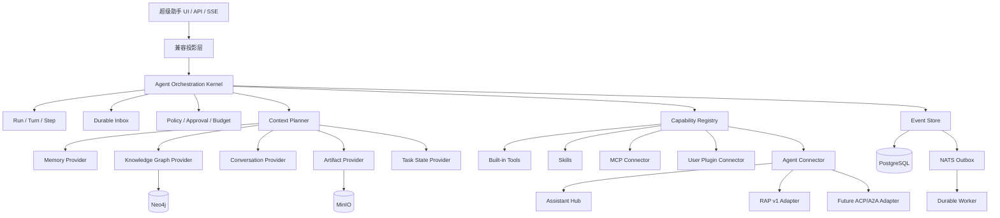

# 超级助手顶层架构设计（提案）

状态：讨论稿

本文只定义 OpenOntology 超级助手升级的目标、边界、核心概念、分层方式和演进原则，不定义具体数据库字段、HTTP 路径或实现任务。后续设计必须先与本文保持一致，再逐层细化。

## 1. 设计目标

超级助手不是一个把所有业务能力都塞进单个模型上下文的巨型 Agent，而是一个面向单用户、多会话和长尾任务的 Agent 编排运行时。它负责理解用户目标、选择合适的上下文、调用受控能力、协调内部和外部 Agent，并在任务完成后交付可验证的结果。

升级后的超级助手必须同时满足以下目标：

- 通过私人知识和长期记忆逐渐理解用户；
- 只把当前任务需要的上下文放入模型请求；
- 以统一方式使用内置工具、Skill、MCP、用户插件和 Agent；
- 调用平台内部助手时严格处理本体、版本、权限等前置条件；
- 调用外部 Agent 时支持进度、取消、审批、恢复和结构化产物；
- 浏览器断开或进程重启后，长任务仍可以恢复；
- 能够重建模型实际看到的上下文、工具目录和执行结果；
- 保留现有平台能力，通过渐进迁移降低商用风险。

## 2. 设计边界

本次升级只针对超级助手作为出站任务编排器的能力。超级助手被外部系统调用、公开新的入站 Agent 协议，不属于第一阶段目标，但内部模型必须为未来增加入站 Connector 留出位置。

`rust-deepseek-harness` 作为架构参考，吸收其事件溯源、Turn/Step、Inbox、能力注册、请求重建和可恢复循环的思想。它的本地 JSONL、单进程内存注册表和任意进程动态挂载不直接作为 OpenOntology 的生产实现。

现有的会话、消息、工具运行、记忆宫殿、Knowledge Graph、MCP、Multica、Assistant Hub、RAP v1 和 NATS 任务体系都是可迁移资产。重构不以一次性替换这些能力为目标。

## 3. 核心架构原则

### 3.1 任务事实与展示传输分离

Run 是任务事实，SSE 是事件传输。浏览器断开不能默认为任务取消；用户显式取消才会改变任务状态。

### 3.2 事件先持久化，再广播

任何模型请求、工具调用、Agent 进度、审批、Artifact 和状态变更，都先写入持久化事件，再广播给 SSE 或其他监听者。监听者失败不能改变任务事实。

### 3.3 模型可见内容必须可重建

发送给模型的消息、system prompt、工具 schema、Context Pack 和模型配置，必须具有可追溯快照。请求发送前必须能够校验请求与快照一致。

### 3.4 能力通过注册表进入运行时

内置工具、Skill、MCP、用户插件、平台助手和外部 Agent 都以 Capability 形式进入运行时。主循环不直接分派具体业务模块。

### 3.5 前置条件由机器校验，交互由用户决定

本体、版本、权限、工作区和凭据等前置条件必须结构化声明并由 Resolver 校验。信息不足时，超级助手给出候选和推荐并询问用户，不能凭自然语言猜测。

### 3.6 记忆与知识有来源、有权限、有生命周期

用户上传的知识、图谱事实、长期记忆和会话摘要都必须保留来源、权限、版本和删除语义。不同来源可以使用不同存储，但必须通过统一 Context Source 接口提供给运行时。

### 3.7 兼容优先，逐步替换

新运行时先通过兼容投影接入现有 HTTP、SSE、数据库和 Agent 契约。只有在事件重放、恢复、并发和真实外部调用验证通过后，才删除旧路径。

## 4. 顶层分层



### 4.1 兼容投影层

兼容投影层保留现有前端和外部契约，让旧的 Conversation、Message、ToolRun、Delegation 和 Remote Task 查询继续可用。它不再承担新的编排逻辑。

### 4.2 Agent Orchestration Kernel

Kernel 只负责：

- Run、Turn、Step 生命周期；
- Inbox 的追加、领取和恢复；
- 工具与 Agent 调用的调度；
- 取消、超时、重试和预算；
- 事件追加和请求重建校验；
- Worker 租约和崩溃恢复。

Kernel 不负责具体业务工具、Knowledge Graph 查询、MCP 连接或本体逻辑。

### 4.3 Capability Registry

Capability Registry 统一管理能力的发现、schema、权限、信任级别、生命周期、健康状态和调用限制。能力可以是进程内实现、MCP 服务、用户安装的插件或 Agent Connector。

### 4.4 Context Planner

Context Planner 根据当前用户目标、Run 状态、权限和 token 预算，选择需要进入模型请求的上下文。常驻 system prompt 只保留稳定规则和当前任务契约，记忆、图谱、附件、Skill 和能力描述按需加载。

### 4.5 Agent Connector

Agent Connector 把平台内部助手、RAP v1 远程助手和未来 ACP/A2A 适配器统一为可调用能力。调用者不需要知道目标 Agent 的传输方式，只需要处理统一的进度、输入、审批、Artifact、完成和失败事件。

### 4.6 Policy / Approval

所有高风险动作通过统一策略层裁决，包括外部 Agent 调用、数据出境、插件安装、写操作、凭据使用和用户确认。插件或 Agent 自身不能绕过 Kernel 的策略。

### 4.7 Event Store 与 Worker

PostgreSQL 保存任务事件和查询投影，NATS 负责后台派发和唤醒。SSE 只是事件订阅方式，不是任务状态的唯一载体。

## 5. 核心执行概念

```text
Run
 └── Turn
      └── Step
           ├── Model Request
           ├── Capability Call
           ├── Approval
           ├── Agent Call
           ├── Context Update
           └── Artifact
```

### Run

Run 表示一个用户目标，可以脱离浏览器连接继续执行。建议支持以下状态：

```text
queued
planning
running
waiting_input
waiting_approval
waiting_external
waiting_retry
cancel_requested
cancelled
paused
succeeded
failed
interrupted
expired
```

`waiting_input` 和 `waiting_approval` 是可恢复状态，不是失败。用户补充信息或完成审批后，Run 从原位置继续。

### Turn

Turn 是一次模型决策周期。一个 Turn 可以包含多个只读工具调用、写操作、Agent 调用或等待事件。

### Step

Step 是最小的可审计和可重试执行单元。所有工具调用、Agent 调用、审批和外部回调都必须属于某个 Step。

所有状态转换都必须使用条件更新、版本号或租约，保证取消、超时、完成和回调并发时只有一个终态生效。

## 6. 统一能力模型

每个 Capability 至少需要声明：

```text
key
version
description
input_schema
output_schema
permissions
trust_level
supports_stream
supports_cancel
supports_approval
supports_artifact
timeout
max_calls
session_scope
```

用户插件还需要声明安装来源、依赖、健康检查、凭据范围和资源限制。安装过程应遵循：

```text
validate manifest
→ freeze revision
→ approve
→ install
→ healthcheck
→ mount
```

卸载过程应先停止新调用，处理或取消在途调用，回收进程和凭据，再保留完整审计记录。

## 7. 统一 Agent 调用模型

Agent Descriptor 需要同时提供人类可读的描述和机器可验证的约束：

```text
key
version
description
input_schema
output_schema
context_requirements
supports_stream
supports_cancel
supports_approval
supports_artifact
auth_scope
timeout
session_policy
```

例如，本体助手可以声明 `ontology_id` 和 `release_id` 为必需上下文。Resolver 尝试从当前会话、最近使用记录和用户选择中解析；没有候选或存在歧义时，必须向用户询问，并附带候选和推荐理由。

统一 Agent 事件包括：

```text
agent.started
agent.progress
agent.needs_input
agent.approval_required
agent.artifact_declared
agent.artifact_completed
agent.completed
agent.failed
agent.cancelled
```

RAP v1 先通过 Adapter 保持兼容。ACP/A2A 后续作为可选 Connector，不直接成为 Kernel 的硬依赖。

## 8. 记忆、知识与上下文

Memory 和 Knowledge Graph 继续使用各自合适的存储，但统一实现 Context Source 接口。每条上下文候选都必须携带：

```text
source_id
source_type
content
authority
confidence
sensitivity
citation
version
ttl
token_cost
permissions
```

事实权威顺序建议为：用户原始资料、来源明确的图谱事实、用户确认的长期记忆、反思候选、模型推断。来源冲突时必须显式暴露冲突，不得静默覆盖。

用户上传知识自动进入索引，但抽取出的长期记忆和敏感事实需要按照风险策略进入候选或审批。删除文件、记忆或来源时，相关图谱事实和上下文引用必须能够失效。

## 9. 长任务和恢复

长任务与 SSE 请求解耦：

- 浏览器断开时 Run 默认继续；
- 用户显式取消才写入 `cancel_requested`；
- Worker 使用租约执行 Run；
- Worker 崩溃后可重新领取未完成 Run；
- SSE 支持按事件序号重新订阅；
- 重复回调和重复派发通过幂等键收敛；
- 无法协作取消的外部 Agent 必须显示真实状态。

这套机制先按单用户、多会话设计，同时保留未来多实例接管所需的租约和版本控制。

## 10. 不属于本层的内容

以下内容暂不在本文固化：

- 具体数据库字段和 Alembic revision；
- 新旧 API 的最终路径；
- ACP/A2A 的具体版本选择；
- 插件进程的最终沙箱实现；
- Context Planner 的具体排序算法；
- 默认并发、超时和 token 数值；
- 前端任务工作台的页面布局。

这些内容必须在顶层边界稳定后，分别形成执行模型、能力模型、上下文模型、Agent Connector、插件和迁移设计。

## 11. 演进顺序

建议按以下顺序细化和开发：

1. 冻结 Run/Turn/Step/Event 顶层语义；
2. 定义事件闭合、请求重建、终态不可逆和幂等不变量；
3. 在现有 Runtime 中以 shadow 方式追加事件；
4. 抽取 Capability Registry 和统一策略层；
5. 将 Memory、Palace、会话和附件包装为 Context Provider；
6. 引入可恢复 Worker 和事件订阅；
7. 统一内部助手、RAP v1 和外部 Agent Connector；
8. 增加 Artifact、审批、取消和前端任务时间线；
9. 在真实重启、取消、并发和外部 Agent 验证通过后删除旧执行路径。

后续任何局部设计都必须回答一个问题：它属于 Kernel、Capability、Context、Connector、Policy、Artifact、Persistence 还是 Compatibility Projection？如果无法回答，说明边界还没有设计清楚。
