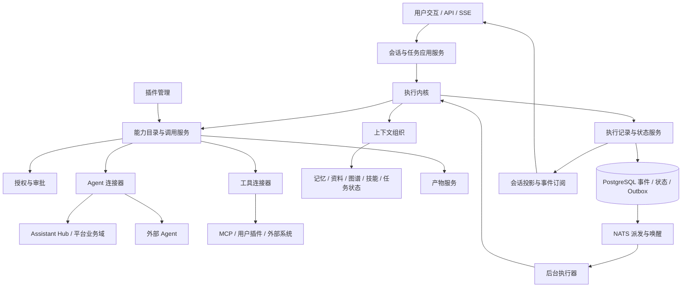

# 超级助手顶层架构设计（开发基线 v1.0）

状态：开发基线 v1.0 的顶层说明；代码仍按源码、测试、Alembic 和部署探针验收。

## 1. 目标与已确认边界

超级助手负责理解用户目标，按需组织私人知识与记忆，协调平台能力和外部 Agent，交付可检查的结果。升级的衡量标准是任务完成质量、可恢复性、交互连续性和扩展成本。

已确认的产品边界：

- 单用户使用，可以同时开启多个会话；不为假设中的多租户 SaaS 引入新架构。
- 支持长尾任务。浏览器断开不等于取消，系统重启后应能识别已完成工作、安全续行。
- 用户可自建、安装、停用和卸载插件；不要求先建设插件市场。
- 主要调用平台内部助手及外部 Agent；本次不新增“超级助手被外部系统调用”的服务。
- 平台需要承接真实流式进度、取消、人工审批和结构化产物；不能把远端不支持的能力伪装成已支持。
- 不确定的业务选择必须向用户询问，可以给推荐；等待某项输入不能锁住整个会话。
- 本轮采用 `execution_version=kernel.v1` 作为开发目标；仅借鉴 Rust Harness 的插件化、能力目录和生命周期思想，继续使用项目既有技术体系。

## 2. 现状与目标的区别

| 方面 | 当前事实与源码入口 | 目标 |
|---|---|---|
| 主循环 | [runtime.py](../../backend/app/super_assistant/runtime.py) 组装提示、工具、审批与 SSE | 业务能力通过契约接入，运行与浏览器连接分离 |
| 平台委派 | [Assistant Hub](../../backend/app/assistant_hub/contract.py) 提供统一回合契约 | 保留域适配边界，补齐结构化前置条件、等待和结果证据 |
| 外部 Agent | [remote_agent_service.py](../../backend/app/super_assistant/remote_agent_service.py) 提供 RAP v1 direct/pull | 保留真实兼容能力，按需增加协议适配器 |
| 记忆与资料 | [memory_service.py](../../backend/app/super_assistant/memory_service.py)、[palace_service.py](../../backend/app/super_assistant/palace_service.py) | 存储分工保留，统一按需检索、来源与生命周期 |
| 恢复 | [conversation_service.py](../../backend/app/super_assistant/conversation_service.py) 识别遗留生成中断 | 在调用结果、授权和外部状态明确时继续；未知副作用先核实 |

源码是当前行为事实源，本文冻结目标行为；迁移阶段用 execution version 隔离新旧事实源。历史未合入的 Harness 实验仅作参考，未合入原因不能由分支状态推断；不直接合并或复用其迁移。

## 3. 架构边界与依赖方向

这些是职责边界，不是八个微服务。首版在现有后端和 NATS executor 中实现，避免为分层增加部署单元。产物复用 MinIO，图谱复用 Neo4j；不引入第二套业务数据库或消息基础设施。

| 边界 | 负责 | 不负责 |
|---|---|---|
| 会话与任务应用服务 | 会话输入、目标选择、任务切换、查询和交互卡片 | 直接执行领域业务 |
| 执行内核 | 激活、模型循环、等待、预算、取消和恢复决策 | MCP 握手、本体规则、记忆抽取 |
| 能力目录与调用服务 | 能力发现、调用绑定、参数校验、Call 生命周期 | 凭插件声明自行授予权限 |
| 插件管理 | 安装、版本、启停、运行宿主和资源释放 | 任意替换数据库、授权器或内核 |
| 上下文组织 | 检索、预算分配、来源、压缩与请求视图 | 把所有事件或所有工具全文塞给模型 |
| Agent 连接器 | 协议转换、前置条件、会话绑定、进度与结果映射 | 重建另一套平台业务编排器 |
| 授权与审批 | 判断允许、拒绝或需确认，消费既有授权 | 每次重复询问已明确授权的同一动作 |
| 产物服务 | 内容、版本、可读取引用和交付状态 | 用文件存在代替业务正确性验证 |
| 执行记录与状态服务 | 原子状态转换、事件、Outbox、租约与投影 | 替代本体、记忆等领域自身的数据事实 |

模块继续落在 `backend/app/super_assistant/` 能力域内。平台助手适配器留在 `backend/app/assistant_hub/`，其依赖方向仍为 Hub → 业务域，超级助手不得直连本体或业务探索编排器。前端先沿用现有路径，不通过设计文档擅自批准 features 迁移。

## 4. 核心概念

| 概念 | 唯一语义 |
|---|---|
| Conversation | 用户持续交流的容器，承载多个先后或并行的目标 |
| Run | 一个有目标、约束与验收依据的执行任务，可跨多次激活 |
| Turn | Run 被输入、外部结果或续行信号唤醒后的一次激活，可包含多个 Step；主动让出执行权时结束 |
| Step | 一次模型请求及其产生的 Call 的登记/调度边界；不等于单个工具调用 |
| Call | 一次逻辑能力调用，可能比发起它的 Step/Turn 存活更久 |
| Attempt | 一次实际模型请求或能力发送尝试；重试保留原尝试，不覆盖历史 |
| Inbox | 待消费的用户消息、结果、确认和控制命令 |
| Artifact | 可独立读取、引用和验证的产物，完整性与业务有效性分别记录 |

详细执行语义以 [执行模型](./super-assistant-execution-model.md) 为准。只保留这套定义，插件和 Connector 文档不得另建同名不同义的状态机。

## 5. 必须保持的不变量

### 5.1 可恢复不等于自动重做

能够确定未发送或确定可幂等重试时才自动重发。外部写操作可能已成功而回包丢失时，先查询或请求用户核实。事件日志不能提供跨外部系统的 exactly-once 保证。

### 5.2 执行事实与传输分离

持久化后再发布事件，SSE 断开不取消 Run。NATS 提供派发和唤醒，PostgreSQL 提供任务事实；等待外部结果时释放执行资源。模型增量可以合并成小批写入，不要求逐 token 单独事务。

### 5.3 模型请求有确定的视图

实际请求由被选中的消息、上下文版本、技能和能力定义构成。记录其精确视图，并在发送前核验；不把整份事件日志当作模型历史。压缩也是有来源的上下文变换。

审计不要求披露隐藏推理或凭据。用户删除数据后，正文和相关快照按保留策略清除；可以保留不含正文的执行元数据，但不得声称仍能完整重建被删除内容。

### 5.4 用户授权和当前权限共同生效

用户已授权的范围继续有效，不因接入新架构重复确认。调用前检查当前权限、资源范围和版本；旧审批不能授权变更后的目标或载荷。插件自称只读或受信任不等于平台认证。

### 5.5 等待的是具体工作，不是整个用户

缺少本体或版本时提出问题、保留任务状态。可继续无依赖工作，用户也能处理另一个目标。输入通过关联 ID 返回原等待项，不按“最近一个任务”猜测归属。

### 5.6 任务完成必须有结果依据

Run 的目标、验收要求和已有证据是显式工作状态。模型输出完成标记只是一项建议；根据任务检查交付物、工具结果和领域验证证据。预算耗尽或输出了一段最终文字不能自动等于成功。

### 5.7 业务事实由业务域掌握

发布版、草稿、可写性、归属和版本变更由既有领域服务判定。用户的明确选择可以复用；“最近使用”只用于推荐，不自动代表当前意图；该规则对 `binding_mode=delegated` 是硬约束，direct UI 继续遵循显式选择和 current-release 兼容语义。

## 6. 扩展模型

Plugin 是可安装的能力包，Capability 是包提供的能力，Connector 是调用适配器，Skill 是按需加载的行为说明。四者不能等同。

能力共享身份、版本、授权和来源元数据，工具与 Agent 保留不同调用语义；Skill 不需要硬套执行、取消、Artifact 等字段。可信平台代码可以进程内运行，用户提供的可执行代码由独立宿主承载，不能以动态 import 获得平台进程权限。

完整边界见 [能力与插件模型](./super-assistant-capability-plugin-model.md) 和 [Agent 协作模型](./super-assistant-agent-connector-model.md)。是否支持某项协议能力来自实际协商和验证，不能只用统一接口补造能力。

## 7. 私人知识与记忆的分工

- 原始资料保存用户提供的内容，图谱保存来源明确的抽取和关系；图谱是可修订的推导，不自动比原文更可信。
- 长期记忆记录可复用的偏好、事实及交互经验；模型推断先带不确定性和来源，不直接晋升为用户指令。
- 当前 Run 保存目标、已确认选择、计划、未决问题与产物；它们不依赖模型摘要记住。
- 统一 Context Source 用于发现和组织，底层存储和删除责任继续分开。

不设置“某类来源永远优先”的总排序。偏好以用户最新明确表达为准，业务事实结合对应时间、版本和领域证据判断；冲突不能由模型静默覆盖。规则见上下文、记忆与知识专题及开发基线 §9：explicit low-risk 记忆默认自动接纳（用户可关闭），derived/reflection 即使 low-risk 也必须确认，敏感和指令类永不自动接纳；删除按 tombstone→index exclusion→pack exclusion 传播；v1 不跨用户共享记忆。

## 8. 演进与事实源切换

迁移按 Run 的执行版本隔离。旧运行路径产生的任务仍以旧业务记录为准，新增影子事件只用于验证，不能反向成为权威。新内核承接的 Run 以新执行事务和事件为准，旧页面查询由兼容投影提供。

每个迁移阶段只有一个写入责任方。执行状态、事件、Inbox/Call 变更和 Outbox 在同一 PostgreSQL 事务内提交；业务域中已经发生的操作仍由该域记录，跨域结果通过 Call 关联，不要求全平台事件溯源。

兼容只维护已经存在的外部和持久化契约，不为新设计增加通用 fallback。需改变旧行为时单列迁移和契约验证，避免在目录整理中改变语义。

## 9. 分层设计顺序与实现顺序

1. 顶层边界与 [执行模型](./super-assistant-execution-model.md)。
2. [能力与插件模型](./super-assistant-capability-plugin-model.md)、[Agent 协作模型](./super-assistant-agent-connector-model.md)。
3. 上下文、记忆和知识来源治理。
4. 事件载荷、数据模型、协议适配、前端交互与迁移验证。

字段、端点、协议能力、并发、预算、插件隔离和上下文默认值已经在开发基线 v1.0 冻结；实现继续复用现有单体、PostgreSQL、NATS、MinIO 和 Neo4j，不建设分布式工作流引擎。

业务澄清委派必须在调用前绑定目标本体和编辑中的草稿版本；缺少任一条件时进入 `waiting_input`，不得创建无绑定子会话。绑定后的版本、权限和会话引用固定，不能静默漂移。
