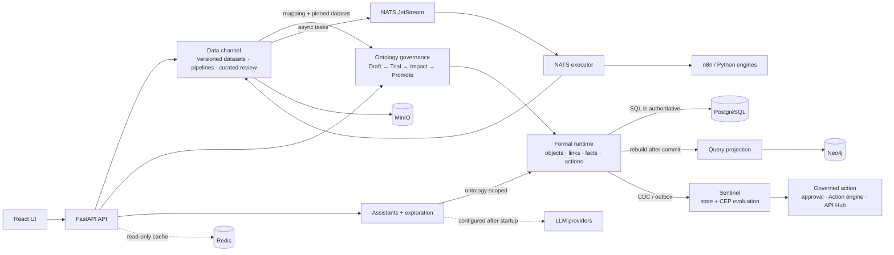

# 平台架构与边界

这张图用于解释当前仓库的运行边界。它不是部署拓扑、可用性承诺或外部系统集成
清单；具体环境仍以 Compose、配置和发布验收为准。

## How to read it

- `Data channel` owns connections, immutable dataset versions, pipelines and curated review.
  Asynchronous pipeline work is dispatched through NATS JetStream to the NATS executor.
- `Ontology governance` owns the version gates. Formal objects, links, facts and actions use
  PostgreSQL as the authoritative state; Neo4j is a rebuilt query projection.
- `Sentinel` evaluates state changes and event patterns from the governed runtime. The action
  path remains reviewable and permissioned.
- `Redis` is a read-only cache in this path. It is not the source of ontology truth or the
  replacement for the NATS executor.
- `n8n`, Python engines, Chromium CDP and model providers are configured dependencies. LLM
  configuration happens after startup and is not required to start the base platform.

Event registration is intentionally absent from the main arrow chain. It currently provides
an independent registration and query capability; the repository does not verify an automatic
`RegisteredEvent → Formal/Sentinel` connection.

The implementation facts behind this diagram are maintained in
[`backend/app/data_channel/README.md`](../../backend/app/data_channel/README.md),
[`backend/app/ontologies/README.md`](../../backend/app/ontologies/README.md),
[`backend/app/main.py`](../../backend/app/main.py), and the corresponding tests.
